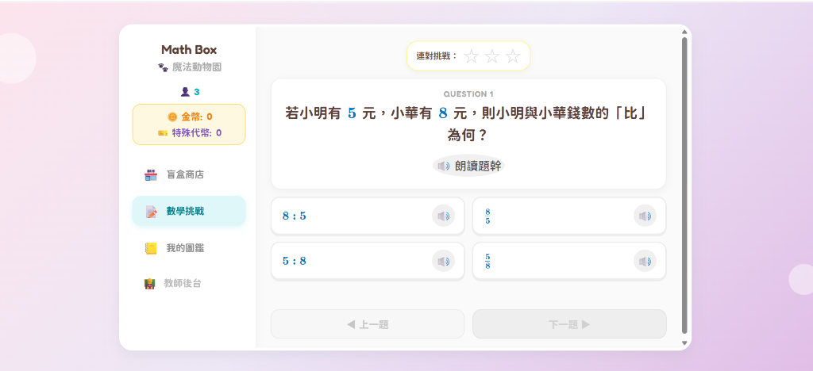

# 🎮 遊戲化互動測驗產生器 (Gamified Quiz Generator)

> 將枯燥的各學科練習題，一鍵轉換為高互動度、高沉浸感的單一獨立「遊戲式互動測驗」！



[](https://opensource.org/licenses/MIT)
[](https://github.com)

---

## 🌟 精選雙大遊戲模板

### 1. 🎲 經典環形大富翁（手動甩骰）(`index.html`)
- 🔄 **經典 6x6 環形外環棋盤**：20 格外環地圖順時針循環繞行，每次經過「🚩 起點 GO」**自動加圈數並領取 150 金幣獎勵**！
- 🎲 **答對親手甩骰子（手動擲骰）**：答對題目後解鎖骰子光芒，學生必須親手點擊骰子甩出步數！
- 🏃‍♂️ **逐格平滑跳躍前進**：棋子伴隨生動跳躍音效逐格前進，踩點觸發幸運寶箱、機會命運與陷阱收費站。
- 🏙️ **收購世界地產**：踩中台北、東京、倫敦、巴黎、紐約等城市可花費金幣收購並插上 `🏡 已購` 地標！

### 2. 🎁 盲盒抽卡養成（動物園圖鑑）(`blind-box.html`)
- 📦 **擬真開箱抽卡動畫**：累積金幣與特殊代幣進行單抽或十連抽，享受開箱震動、金光與音效！
- 🦁 **SSR 稀有度圖鑑養成**：搜集魔法動物園各式夥伴（R、SR、SSR），重複獲得自動升級星級。
- 🔥 **連擊 Combo 經濟**：連續答對題目觸發連擊倍率，獲取額外金幣與特殊扭蛋代幣。

---

## 🛠️ 強大多媒體與無障礙學習支援

- 🔊 **純程式 Web Audio 擬真音效**：答對、答錯、骰子滾動、跳躍、買地、抽卡金光等合成音效，完全零外掛音檔。
- 🗣️ **TTS 智慧語音朗讀**：支援題幹與選項語音朗讀，自動將數學符號口語化。
- 📐 **KaTeX 數學公式支援**：標準 LaTeX 語法渲染清晰向量公式。
- 💾 **自動 LocalStorage 存檔**：自動記錄學生位置、金幣、圈數、已收購地產與錯題歷程。
- 👨‍🏫 **教師後台（預設密碼 `0000`）**：隨時檢視全班學生答題總數、正確率與地產總資產。

---

## 🚀 如何使用

### 1. 安裝 Skill
直接在你的 Antigravity / AI Agent 對話框中貼上以下指令：

> **請安裝這個skill︰https://github.com/chuoneone/gamified-quiz**

安裝完成後，AI 即可自動獲得「遊戲化互動測驗產生器」的所有能力！

---

### 2. 生成遊戲化測驗
隨時提供你的題目給 AI：
> 「*請幫我將這份試題（國文/英文/數學/自然/社會）做成大富翁遊戲測驗（或盲盒抽卡測驗）*」

AI 將自動為你生成完整的單一檔案互動測驗 HTML！

---

### 3. 線上或離線試玩
* 雙擊開啟 `index.html`（大富翁）或 `blind-box.html`（盲盒抽卡），或訪問 GitHub Pages 即可直接在瀏覽器遊玩！

---

## 📁 專案目錄結構

```text
gamified-quiz/
├── .agents/skills/gamified-quiz/
│   └── SKILL.md          # Antigravity 專案技能定義
├── index.html            # 🎲 大富翁環遊世界遊戲主程式 (手動甩骰/環形繞圈)
├── blind-box.html        # 🎁 盲盒抽卡養成遊戲主程式 (開箱扭蛋/圖鑑搜集)
├── preview.png           # 預覽圖片
├── SKILL.md              # 技能標準說明檔
└── README.md             # 專案說明文件
```

---

## 📄 License
MIT License
